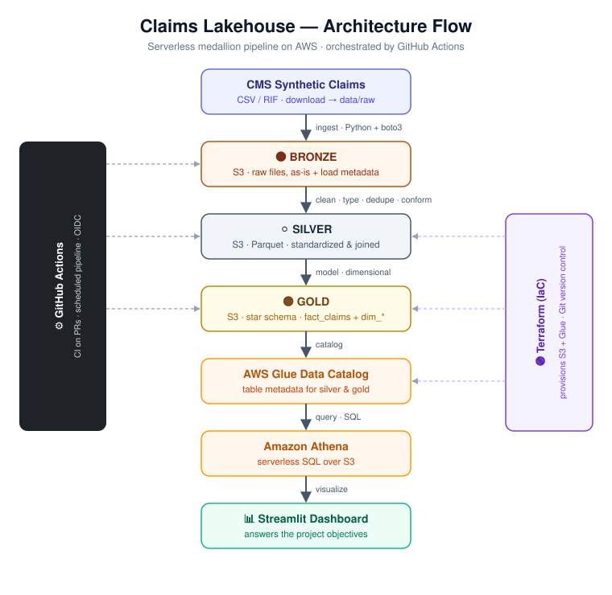

# 🏥 Claims Lakehouse

> An open, build-in-public data engineering project: an end-to-end **medallion architecture** pipeline over **synthetic Medicare claims data**, running on the **AWS free tier**, orchestrated with **GitHub Actions**.


This is a learning-in-public project, and **everyone is welcome to contribute** — whether you're a beginner picking up your first "good first issue" or an experienced engineer improving the architecture. Follow along, open a PR, or just star the repo to watch it grow.

<p align="center">
  
</p>

---

## 🎯 Objective

**Turn raw Medicare claims into answers about cost, care, and chronic disease.**

This project transforms raw claims into an analytics-ready model that answers the questions payers, providers, and health-policy teams actually ask — cost & spend, utilization, diagnosis mix, chronic conditions, demographics, provider and temporal trends, and drug spend — while demonstrating a full medallion architecture, serverless AWS, dimensional modeling, and CI/CD. Because the data is **synthetic**, the goal is to demonstrate the methodology, not to produce real clinical findings.

👉 Full list of questions, plus the concrete metrics the gold layer targets: [`docs/objectives.md`](docs/objectives.md).

## 🏗️ What we're building

A production-shaped data platform that ingests raw Medicare claims, refines them through medallion layers, and serves an analytics-ready star schema you can query and visualize.

```
  Source (CMS synthetic claims)
          │
          ▼
   🟤 BRONZE  →  raw claims landed in S3, as-is + load metadata
          │
          ▼
   ⚪ SILVER  →  cleaned, typed, deduplicated, conformed (Parquet)
          │
          ▼
   🟡 GOLD    →  star schema: fact_claims + dim_* tables
          │
          ▼
   📊 Athena queries + Streamlit dashboard
```

Everything is **serverless and cost-safe** — designed to stay inside AWS free-tier limits (see [Cost guardrails](#-cost-guardrails)).

## 🗂️ The data

We use **public, synthetic** Medicare claims data — no privacy or compliance concerns, safe to share and post about.

- **Default:** [CMS DE-SynPUF (2008–2010)](https://www.cms.gov/data-research/statistics-trends-and-reports/medicare-claims-synthetic-public-use-files/cms-2008-2010-data-entrepreneurs-synthetic-public-use-file-de-synpuf) — pre-split into 20 samples; we start with **sample 1** to keep volumes tiny. Easiest for new contributors to get running.
- **Alternative:** [CMS Synthetic Enrollment, FFS Claims & PDE](https://data.cms.gov/collection/synthetic-medicare-enrollment-fee-for-service-claims-and-prescription-drug-event) — newer, Synthea-generated, RIF format, ICD-10. More realistic, heavier silver layer.

> The data is **not committed** to this repo. See [`data/raw/README.md`](data/raw/README.md) for how to fetch it locally.

## 🧱 Tech stack

| Layer | Tooling |
|---|---|
| Storage | Amazon S3 (bronze / silver / gold prefixes) |
| Compute | Python + AWS Lambda; Athena for SQL |
| Catalog | AWS Glue Data Catalog |
| Orchestration | **GitHub Actions** (free — replaces managed Airflow) |
| IaC | Terraform |
| Dashboard | Streamlit on Athena |
| Quality/CI | pytest, ruff |

## 🚀 Quick start

```bash
# 1. Clone
git clone https://github.com/<your-username>/claims-lakehouse.git
cd claims-lakehouse

# 2. Set up environment
python -m venv .venv && source .venv/bin/activate
pip install -r requirements.txt

# 3. Get the data (see data/raw/README.md), then drop files in data/raw/

# 4. Configure AWS + bucket
cp .env.example .env   # then edit with your bucket name / region

# 5. Run the bronze layer
python -m src.bronze.ingest
```

See the [Makefile](Makefile) for shortcuts (`make bronze`, `make test`, `make lint`).

## 🗺️ Roadmap

Each milestone is a shippable piece — and a good moment to post an update.

- [ ] **Phase 0 — Foundation:** repo, README, budget alert, S3 buckets via Terraform
- [ ] **Phase 1 — Bronze:** land raw claims in S3 with load metadata
- [ ] **Phase 2 — Silver:** clean, type, dedupe, conform → partitioned Parquet
- [ ] **Phase 3 — Gold:** build the star schema (`fact_claims`, `dim_*`)
- [ ] **Phase 4 — CI/CD:** GitHub Actions running tests on PRs + scheduled pipeline
- [ ] **Phase 5 — Dashboard:** Streamlit on Athena + project retrospective

## 🤝 Contributing

We'd love your help! Start with [CONTRIBUTING.md](CONTRIBUTING.md) and look for issues labeled **`good first issue`**. Ways to help:

- Pick up a bronze/silver/gold task from the roadmap
- Add data-quality tests
- Improve docs or the architecture diagram
- Suggest better AWS cost optimizations

All skill levels welcome. Be kind — see our [Code of Conduct](CODE_OF_CONDUCT.md).

## 💸 Cost guardrails

The AWS free tier changed in **July 2025**: new accounts get **$200 in credits over 6 months**, not 12 months of free usage. To stay free:

- ✅ Set an **AWS Budgets** alert on day one.
- ✅ Stay serverless: S3 + Lambda + Athena + Glue Catalog.
- ❌ Avoid NAT Gateways (~$33/mo), EMR, Redshift, managed Airflow (MWAA), and idle RDS/EC2.
- ❌ Delete orphaned EBS volumes, snapshots, and unattached Elastic IPs.

## 📄 License & attribution

Code is licensed under the [MIT License](LICENSE). Data is public/synthetic, provided by the U.S. Centers for Medicare & Medicaid Services (CMS); no real beneficiary data is used.
