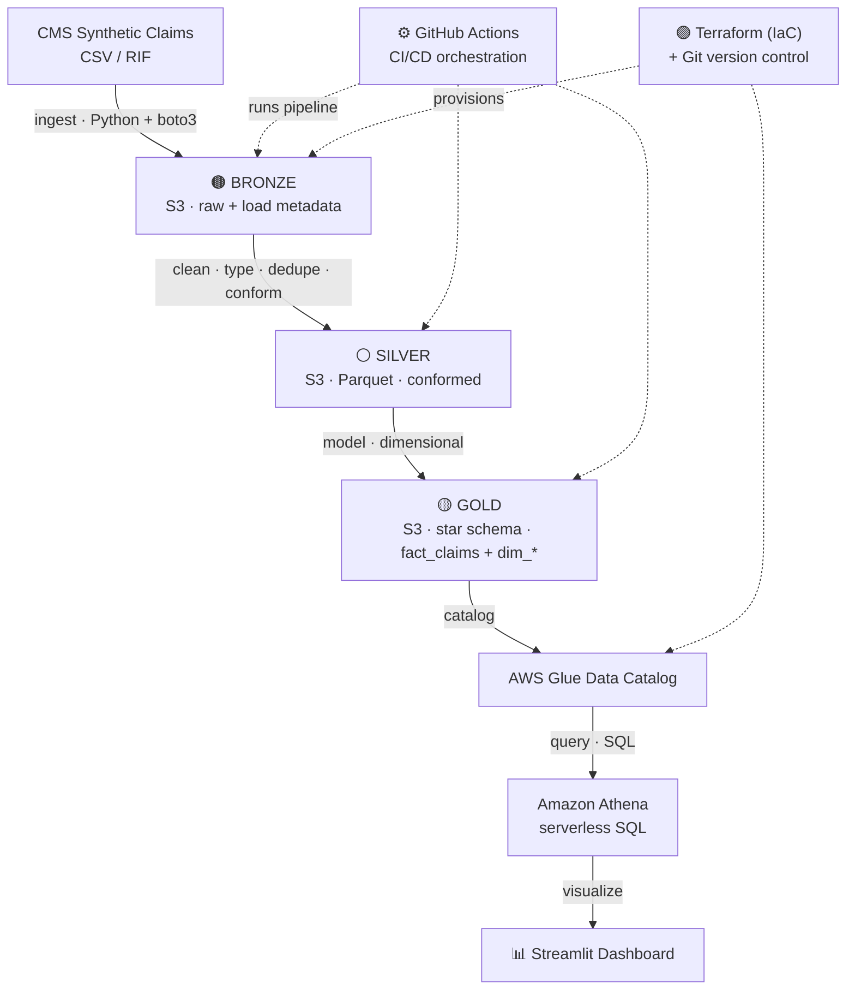

# Architecture


> Rendered image: [`architecture.svg`](architecture.svg) · also available as
> [`architecture.png`](architecture.png). The editable source is the Mermaid
> block below (GitHub renders it automatically).

## Overview

Claims Lakehouse is a serverless medallion pipeline on AWS. Raw synthetic
Medicare claims flow through three quality layers and land as an
analytics-ready star schema queryable with Athena.



```
CMS synthetic claims (CSV/RIF)
        │  (manual download → data/raw/)
        ▼
┌─────────────────────────────────────────────┐
│ BRONZE  s3://bucket/bronze/                  │
│  raw files, as-is + load metadata            │
└─────────────────────────────────────────────┘
        ▼  clean · type · dedupe · conform
┌─────────────────────────────────────────────┐
│ SILVER  s3://bucket/silver/  (Parquet)       │
│  standardized, validated, joined             │
└─────────────────────────────────────────────┘
        ▼  model
┌─────────────────────────────────────────────┐
│ GOLD  s3://bucket/gold/  (star schema)       │
│  fact_claims + dim_beneficiary / provider /  │
│  diagnosis / date                            │
└─────────────────────────────────────────────┘
        ▼
   Athena (SQL)  →  Streamlit dashboard
```

## Why these choices

- **Medallion architecture** cleanly separates raw retention (bronze),
  quality/conformance (silver), and business modeling (gold). It makes
  reprocessing easy and gives each layer a clear responsibility.
- **Serverless** (S3 + Lambda + Athena + Glue Catalog) keeps us inside the
  AWS free tier and avoids the classic credit-eaters (NAT Gateway, EMR,
  Redshift, managed Airflow).
- **GitHub Actions for orchestration** — free, version-controlled, and a good
  demonstration of CI/CD without paying for MWAA.
- **Star schema in gold** — the standard analytics model for claims data
  (a fact table of claim lines surrounded by conformed dimensions).

## Orchestration

- **CI** (`.github/workflows/ci.yml`): lint + tests on every PR and push.
- **Pipeline** (`.github/workflows/pipeline.yml`): scheduled/manual bronze →
  silver → gold, authenticating to AWS via OIDC (no stored keys).

## Cost model

Target: **$0** within free-tier limits. S3 storage and Athena scans at this
data size cost fractions of a cent. Set an AWS Budgets alert regardless.
